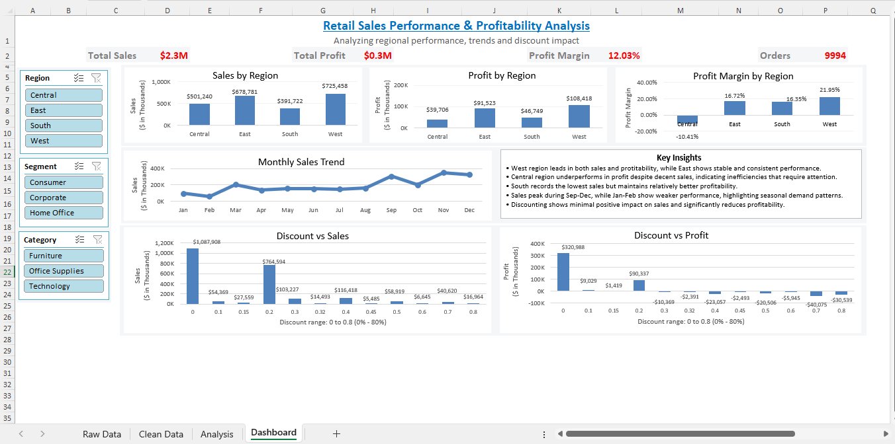
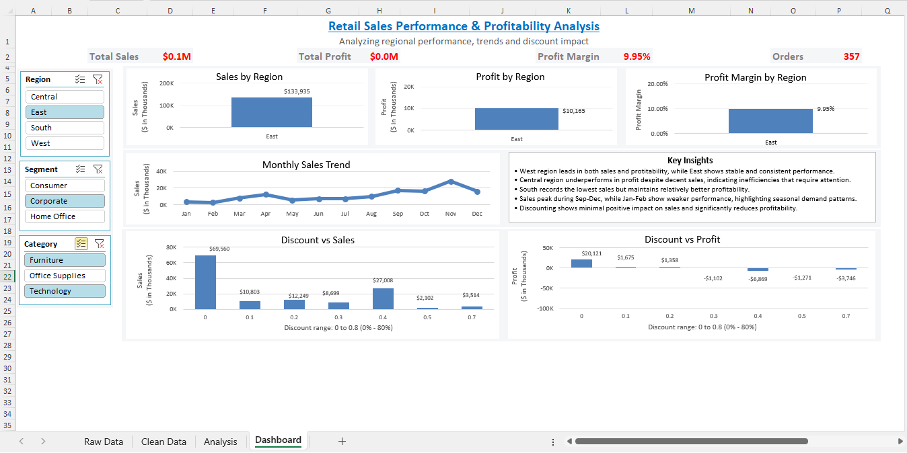
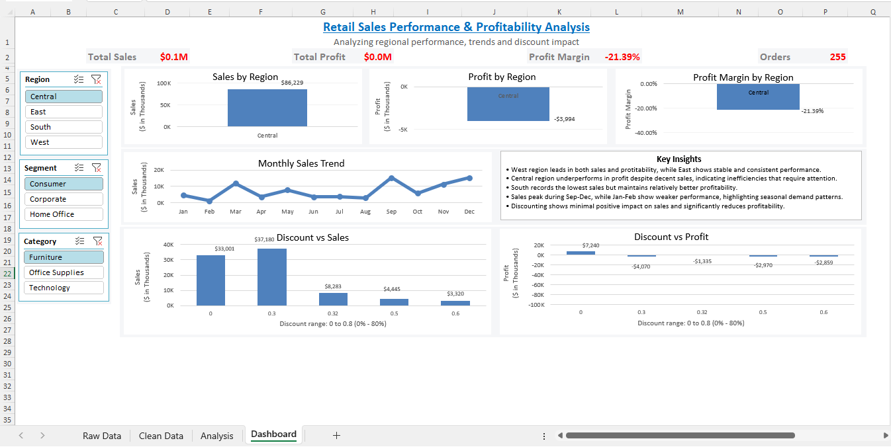

# Retail Sales Dashboard

## Overview
This project is an interactive sales dashboard created in Microsoft Excel to analyze retail sales performance across different regions, categories and customer segments.

The dashboard provides a quick view of key business metrics such as Sales, Profit, Profit Margin and Orders along with insights into regional performance, monthly sales trends and the impact of discounts on profitability.

## Tools Used
- Microsoft Excel
- Pivot Tables
- Pivot Charts
- Slicers
- KPI Cards
- Data Cleaning and Formatting

## Dashboard Features
- Interactive slicers for Region, Segment and Category
- KPI cards showing Total Sales, Total Profit, Profit Margin and Total Orders
- Region-wise comparison of Sales, Profit and Profit Margin
- Monthly Sales Trend analysis
- Discount vs Sales analysis
- Discount vs Profit analysis
- Business Insights based on dashboard findings

## Key Insights
- West region leads in both sales and profitability.
- East region shows stable and consistent performance.
- Central region underperforms in profit despite decent sales, indicating inefficiencies that require attention.
- South records the lowest sales but maintains relatively better profitability.
- Sales peak during Sep-Dec, while Jan-Feb show weaker performance, highlighting seasonal demand patterns.
- Discounting shows minimal positive impact on sales and significantly reduces profitability.

## Project Workflow
1. Reviewed and cleaned the raw dataset.
2. Created a clean data sheet for analysis.
3. Built Pivot Tables to summarize key metrics.
4. Created Pivot Charts for visualization.
5. Added slicers for interactive filtering.
6. Designed an Excel dashboard with KPIs, charts and insights.

## Files Included
- retail-sales-dashboard.xlsx
- retail-sales-dashboard.pdf
- retail-sales-dashboard-1.png
- retail-sales-dashboard-2.png
- retail-sales-dashboard-3.png
- README.md

## Skills Demonstrated
- Data Cleaning
- Data Analysis
- Dashboard Design
- Data Visualization
- KPI Reporting
- Business Insight Generation
- Excel Reporting

## Dashboard Preview
### Dashboard Overview

### Interactive Dashboard View 1

### Interactive Dashboard View 2

